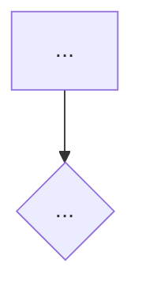

# <Başlık>

## Ne yapar

2-4 cümle, iş diliyle. Kod adı kullanma; kullanılırsa açıkla.

## Kurallar ve baremler

| Kural | Değer | Kaynak | Nerede yaşıyor |
|---|---|---|---|
| ... | somut sayı + birim | sabit adı / dosya | kod / DB (koleksiyon adı) / env (değişken adı) / dış sistem |

## Akış

Numaralı adımlar. Hata dönen her kontrolde hata kodunu yaz (örn. `PVP_DAILY_LIMIT_REACHED`).

## İstemciye açılan uçlar

| Uç | Tür |
|---|---|

## Kenar durumlar

## Bilinen sorunlar

Kod-yorum çelişkileri, onay bekleyen bulgular, canlıda görülen anomaliler (tarihiyle).

## İlgili

Diğer akışlar ve use case kartları (link).
