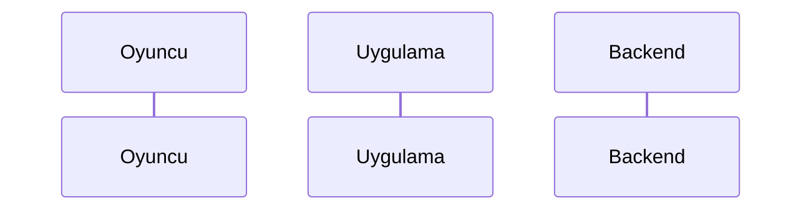

# <Başlık>

## Ne yapar

2-4 cümle, iş diliyle: oyuncu açısından bu özellik nedir, ne işe yarar. Kod adı kullanma; kullanırsan açıkla.

## Oyuncu ne görür ve nereden gelir

Hangi ekran/katman (rota, modal, panel, sekme); nereden açılır (alt menü, HUD butonu, bildirim, derin bağlantı, başka ekran). Ekran kartlarına link: [/pvp](../../ekranlar/pvp.md).

## Görünme koşulları

| Bileşen / öğe | Ne zaman görünür (ya da gizlenir) | Koşulun kaynağı | Dosya |
|---|---|---|---|
| ... | ör. "yalnız Pro değilse", "maç penceresi dışında", "tutorial 3. adımdan sonra" | backend alanı (`me.isPro`) / jotai atom (`proUpsellOpenAtom`) / uzak ayar (`pvp_matchmaking_enabled`) / yerel saat / tutorial | `src/...` |

## Akış

Numaralı adımlar: oyuncu eylemi → uygulamanın yaptığı (GraphQL çağrısı, önbellek, yönlendirme) → oyuncunun gördüğü.

## Çağrılan API'ler

| İşlem | Ne zaman | Backend alanı | Backend tarafı |
|---|---|---|---|
| [CreatePvpMatch](../../api/create-pvp-match.md) | "Meydan oku" basılınca | `createPvpMatch` | [Meydan okuma](../../../backend/flows/pvp/meydan-okuma.md) |

Sonrasında yenilenen sorgular (refetchQueries) ve önbellek güncellemeleri varsa yaz.

## Hatalar ve boş durumlar

| Durum | Oyuncu ne görür | Kaynak |
|---|---|---|
| Backend `PVP_DAILY_LIMIT_REACHED` döner | ör. "Bugünlük hakkın bitti" uyarısı (`pvp_limit_reached` çeviri anahtarı) | `src/...` |

## Uzak ayarlar, bayraklar ve sabitler

Firebase Remote Config anahtarları, kod içi sabitler (süre, limit, sayı), varsayılan değerleri ve nerede yaşadıkları. Değer uygulamada değil Firebase'de ise "Firebase'de; koddaki varsayılan X" diye yaz.

## Analitik olaylar

Bu akışta gönderilen `track()` olayları ve ne zaman.

## Kenar durumlar

## Bilinen sorunlar ve tutarsızlıklar

Frontend ile backend'in uyuşmadığı yerler, ölü kod, yorum ile kodun çeliştiği yerler (tarihiyle).

## İlgili

Diğer akışlar, ekran kartları, backend dokümanları.
