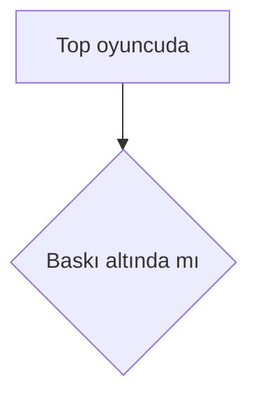

# <Başlık>

## Ne yapar

2-4 cümle, futbol ve iş diliyle: maçta bu mekanizma neyi belirler, oyuncu/PM açısından neden önemli. Kod adı kullanma; kullanırsan açıkla.

## Girdiler

Bu mekanizmayı ne besler:

| Girdi | Nereden gelir | Etkisi |
|---|---|---|
| Oyuncu statı ([`shortPassing`](../../metrikler/short-passing.md)) | backend oyuncu verisi (`detailedStats`) | pas isabeti çarpanı |
| Takım taktiği (`pressing`) | maç girdisi, backend | pres hacmi |
| Veri modeli (`passing_model.json`) | SkillCorner'dan türetilmiş tablo | pas seçimi olasılıkları |
| Rastgelelik | maç tohumu (seed) | aynı tohum aynı maçı üretir |

## Nasıl çalışır

Numaralı adımlar, karar sırasıyla. Gerekiyorsa diyagram:

## Sayılar ve etki büyüklüğü

Sabitler, çarpanlar (gain), eşikler: değer + birim + dosya. "Statı 90 olan oyuncu 60 olana göre ne kadar farklı?" sorusuna sayıyla cevap ver (ör. `attrFactor(stat, 0.12)` → 60'ta ×0.96, 90'da ×1.08). Etkinin nereye gittiğini söyle: olasılık mı, hız mı, sıklık mı, isabet sapması mı.

## Hangi veriden türetildi

Sayının kaynağı: SkillCorner ölçümü (hangi miner, `analysis/<miner>.py`; hangi model, `analysis/out/<model>.json`), literatür varsayımı ya da elle seçilmiş değer. Kodun yorumunda yazan gerekçeyi aktar.

## Maç çıktısına etkisi

Bu mekanizma hangi istatistiğe, olaya, highlight'a, oyuncu reytingine yansır.

## Kenar durumlar

## Bilinen sorunlar ve sınırlar

Faz-2 (henüz tam bağlanmamış) mekanikler, kodun yorumuyla çeliştiği yerler, backend'le uyuşmazlıklar (tarihiyle).

## İlgili

Diğer akışlar, metrik kartları, backend dokümanları.
